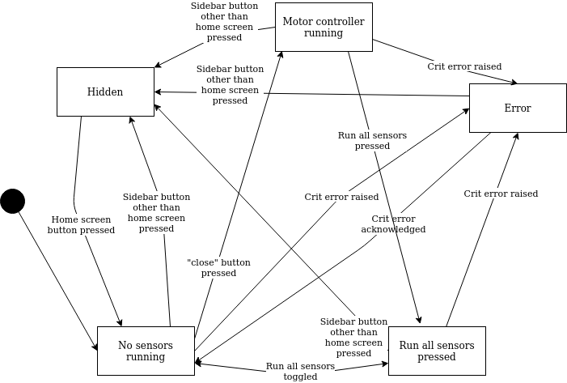
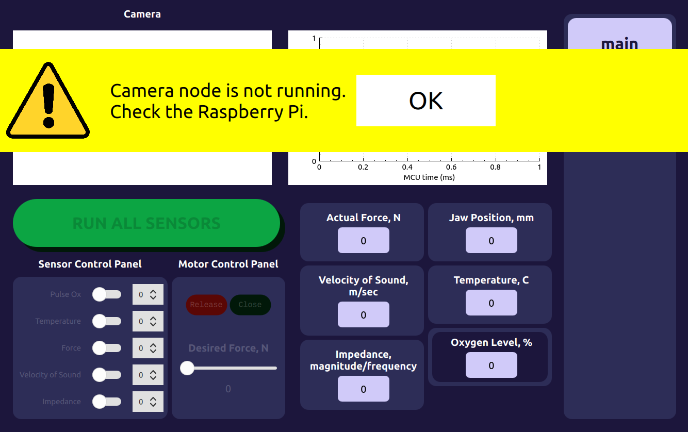
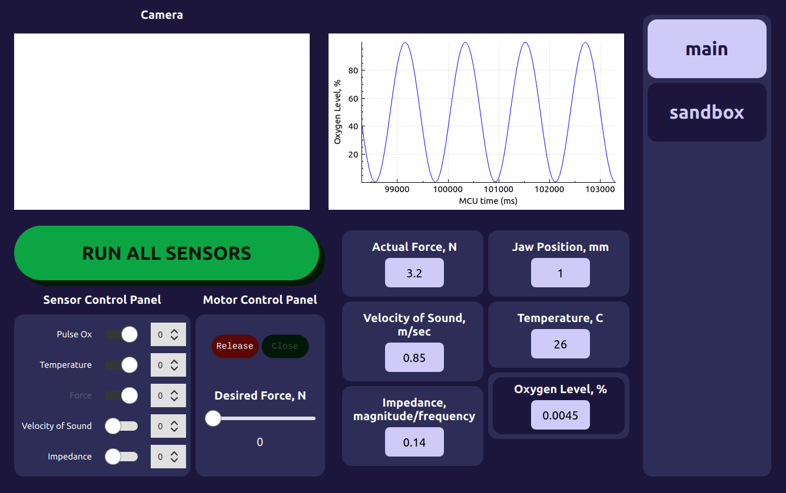
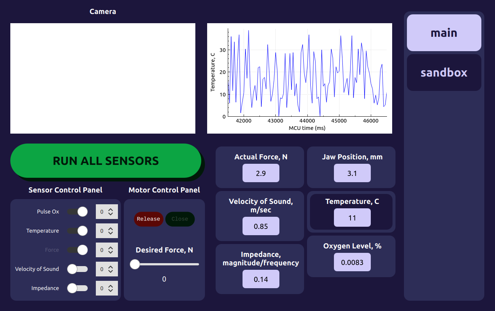
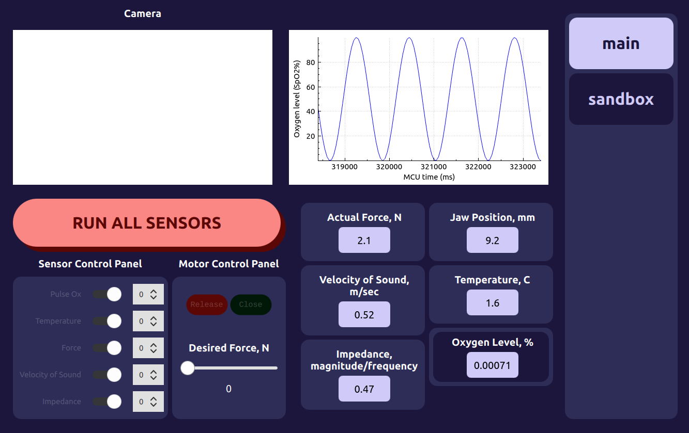

# Smart Grasper ROS Network, Basic Setup

## Overview

This code is designed to run a rosnetwork on two devices, one of which is a
Raspberry Pi 4 connected to a teensy, and the other of which is a laptop running
a GUI and performing data acquisition.

## ROS Master Setup

The laptop runs as the ROS master in this multi-device ROS network.

### Platform Requirements
- CPU with an Ubuntu 18.04 OS. If you configure the network correctly you should
  able to run the ROS master on a virtual machine.

### Installation Requirements
- Install OpenCV2 (`sudo apt-get install python-opencv`)
- Install opencv libraries (these libraries are for linking with C++ source
  code). Follow
  [this](https://docs.opencv.org/master/d7/d9f/tutorial_linux_install.html)
  guide. Make sure to `sudo make install` after following the instructions.
- Install ROS Melodic (follow
  [these](http://wiki.ros.org/melodic/Installation/Ubuntu) instructions). Make
  sure to follow all steps.
- Install qt5 and associated packages:
  ```
  sudo apt-install qtcreator
  sudo apt-install qt5
  sudo apt install qml-module-qtquick-controls2
  sudo apt install libqt5charts5 libqt5charts5-dev
  ```
- Install [this](https://github.com/severin-lemaignan/ros-qml-plugin) software
  to allow you to run ROS in a qt project.

## ROS Slave Setup

The teensy runs as the ROS slave. The teensy is configured to communicate with
the grasper's embedded devices as well as the grasper's camera.

### Platform Requirements:

- Raspberry Pi 4.0
- Ubuntu 18.04 LST operating system flashed to the RPi SD card
  ([this](https://github.com/TheRemote/Ubuntu-Server-raspi4-unofficial/releases)
  distribution was used)

### Installation requirements:
- Install OpenCV2 (`sudo apt-get install python-opencv`)
- Install ROS Melodic (follow
  [these](http://wiki.ros.org/melodic/Installation/Ubuntu) instructions). Make
  sure to follow all steps.
- Enable UART on the RPi (see [the official
  instructions](https://www.raspberrypi.org/documentation/configuration/uart.md)
  or [these
  instructions](https://raspberrypi.stackexchange.com/questions/114366/rpi4-serial-port-not-working-on-either-raspberry-os-or-ubuntu)
  that I found helpful). Be sure to `sudo apt install python-serial`.

## Additional Setup for Multi-Device Network

### Setting up communication between RPi and Laptop

See the [RPi's readme for
instructions](../../rosnetwork_master/catkin_ws/README.md#Setting-up-communication-between-RPi-and-Laptop)
to configure the laptop's network settings correctly.

### Setting up communication between RPi and Laptop

The RPi is the ROS master. To configure the network properly, you first must set
up a static IP address for the RPi (see
[here](https://computingforgeeks.com/how-to-configure-static-ip-address-on-ubuntu/)
if you are unfamiliar with setting this up). You must do this for both the RPi
and the laptop.

Next disable the firewall on the RPi and laptop (`sudo ufw disable`). To see if
you can communicate with the RPi and laptop, ping both devices.

On the RPi, open `~/.bashrc` and add the following:
```bash
export ROS_MASTER_URI=http://localhost:11311/
export ROS_HOSTNAME=$RPI_IP_ADDR
export ROS_IP=$RPI_IP_ADDR
```
where RPI_IP_ADDR is the static ip address of the RPi you configured earlier.

Now, on the laptop, open `~/.bashrc` and add the following:
```bash
export ROS_MASTER_URI=http://$LAPTOP_IP_ADDR:11311/
export ROS_HOSTNAME=$RPI_IP_ADDR
export ROS_IP=$RPI_IP_ADDR
```
where LAPTOP_IP_ADDR is the static ip address of the laptop you configured
earlier. Note that the only thing different from the RPi is the first line.

### Synchronizing RPi's slock with laptop

To synchronize the RPi4's clock with the laptop, `sudo apt-get install chrony`
and then add this line to `/etc/chrony/chrony.conf`:
```
server <c1> minpoll 0 maxpoll 5 maxdelay .05
```
Where `<cl>` is the name of the laptop

## Building and Launching the Network

### ROS Master

- In `rosnetwork_master/catkin_ws`, run `catkin_make`.
- Source `rosnetwork_master/catkin_ws/devel/setup.bash`. Add this to your
  `~/.bashrc` for convience.
- In a terminal start the master (run `roscore`).
- Open qtcreator (run `qtcreator &`). 
- Select to open an existing project and open `grasper-gui/grasper-gui.pro`.
  From here the project should be configured such that you can edit/run/debug.

### ROS Slave

- In `rosnetwork_slave/catkin_ws`, run `catkin_make`.
- Source `rosnetwork_slave/catkin_ws/devel/setup.bash`. Add this to your
  `~/.bashrc` for convience. 
- Assuming `roscore` is running on the master device, start running the serial
  node (`rosrun serial_pkg serial_node.py`). This will capture serial messages
  and package them as ROS messages and send any received serial requests across
  the UART line.
- To capture camera footage, start running the camera node (`rosrun camer_pkg
  camera_node.py`).

# SW Documentation

## High Level Overview

Real time microcontrollers are used at low level to interact with the system’s
hardware components. An RPi interacts with these microcontrollers, through which
user interaction takes place. A laptop runs a GUI that allows a user to view
sensor information and send requests to the hardware. The laptop also allows to
a more permanent location.

## Network SW Architecture Documentation

### ROS Messages

Custom messages are designed to pass information around from the serial node.
The following messages are currently defined in
`rosnetwork_master/catkin_ws/src/grasper_msg/msg`:

- **ImpedanceDataMessage, ThermistorMessage, UltrasonicDataMessage,
  PulseOxRxMessage**: Similar message structures, contains a timestamped chunk
  of data that would be packaged and sent up from the embedded system.
- **MotorMessageFeedback**: Contains a timestamped force and position
  measurement.
- **SensorRequestMessage**: Contains flags for enabling different sensors (aside
  from sensors owned by the grasper's motor controller) as well as an "index"
  associated with the sensor measurement that may be used signal different modes
  (to be used by the embedded system). This message type is sent by the GUI
  node.
- **MotorRequestMessage**: Contains a desired force and whether or not the motor
  controller should be active. This message type is sent by the GUI node.

Along with these custom messages, generic "bool" messages are sent by nodes to
signal to other nodes that they are running. The serial node, for example, will
send out a message at a perscribed rate to signify that the serial node is
running and not in a fail state so that this information may be processed and
displayed by the GUI.

#### Adding Another Custom ROS Message

Persumabely in the future, we would like to modify the network and serial
handler to handle different messages. The following describes how to add a ROS
message to the `grasper_msg` ROS package and how to add a listener callback to
the serial node to receive data when a message with a matching unique ID matches
that of the message.

- Add a new `.msg` file to `rosnetwork_master/catkin_ws/src/grasper_msg/msg`.
- Add the file to the `add_message_files` section in
  `rosnetwork_master/catkin_ws/src/grasper_msg/CMakeLists.txt`.
- If you want this message to be used to receive data from the teensy, in
  `rosnetwork_master/catkin_ws/src/serial_pkg/src/serial_handlers.py`, make a
  new handler class with `__init__` and `__call__` functions. In the
  `receiveHandlers` dict, add the handler id mapped to the handler class.
- If you want to send data from the teensy, in
  `rosnetwork_master/catkin_ws/src/serial_pkg/src/serial_node.py`, add a new
  subscriber. Pass in the custom message you defined as well as a function you
  define in the SerialNode class below `__init__`.
- Run `catkin_make` in `rosnetwork_master/catkin_ws` and
  `rosnetwork_slave/catkin_ws` (! important, the `grasper_msg` directory in
  `rosnetwork_slave` is a symbolic link to that in `rosnetwork_slave` !).

### Serial Node

TODO

## GUI SW Architecture Documentation

The GUI currently runs in Qt with ROS support to allow the GUI to interact with
the serial node and eventually a camera node. The GUI has been defined to meet
the following requirements:

- Display any sensor measurement data. This data shall be received by
  subscribing to the various data publishers that are created by the serial
  node.
- Graph any selected sensor measurement data.
- Select which sensors to run. This data must be requisitioned and passed into
  the ROS network to be sent to the embedded system by the serial node.
  Furthermore, an id shall be associated with a sensor measurement request that
  shall be used by sensors to go into particular modes.
- Easily "select all" sensors at once.
- Easily input a particular desired motor force to be used by the embedded
  system's force controller.
- Have logic behind which switches shall be enabled and which shall be disabled
  depending on the current state of the GUI and system.
- Have the ability to display different types of errors. In particular, a
  "critical" and "noncritical" error shall be allowed to be constructed by
  various parts of the software and a global error handler shall correctly
  handle the queueing of errors based on severity and timestamp.
- Display camera data.
- Have an easy to use interface for testing the smart grasper in a surgical
  setting.

This GUI is seperate from any data collection service. Data collection shall be
handled by another program.

### GUI State Machine

A state machine that moderates the high functionality of the GUI is shown in an
image below. This state logic is defined at the top of
`grasper-gui/qml/HomeScreen.qml`



The following holds true about the following states:
- **Hidden**: In this state, some screen other than the home screen with all
  current functionality is shown.
- **No sensors running**: In this state, the motor controller is not running.
  Because this is true, none of the other sensors should be collecting data. As
  such, all the measurement buttons are disabled (except the "RUN ALL SENSORS"
  button).
- **Run all sensors pressed**: In this state, the individual measurements are
  toggled on and disabled. As such you must toggle the "RUN ALL SENSORS" button
  to exit this state. In this state, the motor controller is also automatically
  enabled and the buttons associated with turning on/off the motor controller
  are disabled (rendering the motor controller in a perminent on state until the
  "RUN ALL SENSORS" button has been pressed).
- **Motor controller running**: In this state, the motor controller is running
  and measurements may be toggled or untoggled (these buttons are enabled).
  Furthermore, the desired force slider may be used to specify the desired force
  for the motor controller.
- **Error**: In this state all measurement buttons are disabled until the errors
  are resolved (in which case the machine starts again at the "no sensors
  running" state).

Note that in any state except the hidden state, the user may select a
measurement to graph and a "index" associated with a measurement request (see
sensor control panel in screenshots below).

### GUI Screenshots of Various States

This is an example of how a critical error is handled on the GUI that may be
acknowledged and hidden. Those that cannot be hidden (for example, if the serial
node is disconnected) don't have the "OK" button. Note that the sensor control
and motor control panels have been disabled while this error is active.



Next is a screenshot of the grasper running under normal operation (without the
camera node running). The user must first select the "close" button to engage
the grasper jaw motor controller, then has selected to measure pulse ox and
temperature. Force and jaw position are automatically measured when the motor
controller is engaged. This screenshot is taken when the data mock script is
running, which just mocks the serial node by creating a bunch of publishers for
each measurement that the GUI can subscribe to (run `rosrun sensor_pkg
data_mock.py`).



Next is a screenshot of the GUI running with temperature selected to be graphed.
Any of the measurements on the lower right of the screen may be selected and
displayed on the upper right graph.



Next is a screenshot of the GUI running the "RUN ALL SENSORS" button selected.
When in this mode, it can be seen that all sensor buttons are disabled as they
are all perminently selected until the "RUN ALL SENSORS" button has been toggled
off.


